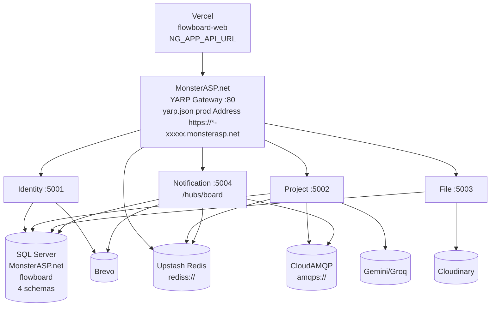

# FlowBoard

> **FlowBoard is a multi-tenant project management platform inspired by Jira and Linear.**

[](https://dotnet.microsoft.com/) [](https://angular.dev/) [](https://microsoft.github.io/reverse-proxy/) [](LICENSE) [](https://flowboard.vercel.app)

**Live Demo:** Frontend `https://flowboard.vercel.app` (Vercel) · Gateway `https://gateway-xxxxx.monsterasp.net/health` (MonsterASP.net) · **API Docs:** `/scalar` `BluePlanet` `OpenAPI` on `5000-5004/swagger`

**Summary:** `Frontend: Angular` `Backend: .NET Microservices` `Gateway: YARP` `Database: SQL Server` `Cache: Redis / Upstash` `Message Queue: RabbitMQ / CloudAMQP` `Real-time: SignalR` `AI: Gemini + Groq`

---

## Table of Contents
1. [Overview](#1-overview)
2. [Key Features](#2-key-features)
3. [Screenshots](#3-screenshots)
4. [Technology Stack](#4-technology-stack)
5. [System Architecture](#5-system-architecture)
6. [Project Management Model](#6-project-management-model)
7. [Authentication, Authorization & Multi-Tenancy](#7-authentication-authorization--multi-tenancy)
8. [AI-Assisted Development](#8-ai-assisted-development)
9. [Redis Caching](#9-redis-caching)
10. [Message Queue & Asynchronous Processing](#10-message-queue--asynchronous-processing)
11. [Rate Limiting](#11-rate-limiting)
12. [Logging & Observability](#12-logging--observability)
13. [SuperAdmin Platform](#13-superadmin-platform)
14. [Performance & Frontend Engineering](#14-performance--frontend-engineering)
15. [Deployment Architecture](#15-deployment-architecture)
16. [Future Improvements](#16-future-improvements)
17. [Author](#17-author)

---

## 1. Overview

FlowBoard is a multi-tenant project management platform inspired by Jira and Linear.

It provides organizations with workspaces and projects for managing issues, boards, sprints, teams, members, files, notifications and AI-assisted project workflows.

The platform is built using Angular and .NET microservices with Redis caching, RabbitMQ messaging, SignalR real-time communication, AI provider integration, and a dedicated SuperAdmin platform portal.

**Why FlowBoard — not just CRUD:** Jira/Linear pain is not `Create Task` but `SaaS` `multi-tenant` `isolation` `custom roles` `permission` `cache` `async` `realtime` `AI` `platform ops` — FlowBoard proves `Board Status mapping` `1 column = N statuses` `1 status = 1 column per board` `Outbox 2s` `Sliding Window Lua atomic` `ETag 304` not just `CRUD` screens.

---

## 2. Key Features

**Project Management**
- Organizations and Workspaces
- Projects
- Boards and columns
- Issues / Tasks
- Subtasks
- Comments
- Sprints
- Teams and team members
- Project members
- Environments
- File attachments

**Collaboration**
- Activity history
- Real-time notifications
- SignalR updates
- RabbitMQ asynchronous messaging

**Security**
- JWT authentication (15m + 7d HttpOnly refresh, reuse-revoke)
- Role-based authorization (fixed 0-3)
- Permission-based authorization (32 keys via `RolePermissions`)
- Custom organization roles (`OrganizationWorkspaceRoles`)
- Multi-tenant isolation (org → workspace → project)
- Platform-level SuperAdmin (`Users.IsSuperAdmin`)

**AI**
- AI issue drafting
- Issue enhancement (diff pending)
- Acceptance criteria generation
- Issue breakdown to subtasks
- Gemini + Groq provider abstraction
- Provider fallback (no silent switch)
- AI usage tracking (provider/model/tokens/latency/cost)

**Platform Engineering**
- YARP API Gateway + Rate Limiting
- Redis caching + ETag 304
- Sliding Window Counter Redis Lua atomic
- Serilog structured JSON logging
- Correlation IDs `X-Correlation-Id` `N`
- Health checks `/health` `/health/ready` + Scalar `BluePlanet`

---

## 3. Screenshots

> 5–6 strong `MacBook` frames `light/corporate` `cupcake` `6` themes, not every screen.

### Project Overview

*Kpis → Burndown (ApexCharts) → Activity timeline — Org/Project health.*

### Kanban Board

*Board `Engineering` `To Do` `In Progress` `Done` — `CDK DragDrop` `lock SET NX PX 5000` + realtime `SignalR`.*

### Issue Management

*Issues `Backlog` ( `ListId null` ), `Assignee` `org ∩ workspace ∩ project` + `Status` per project.*

### Sprint Management

*Sprint time-box per `Board`, `Team` filter `FilterJson {teamIds}` — `Board` is view over `Issues`.*

### AI-Assisted Issue Workflow

*`AI Draft` `Enhance` `Criteria` `Breakdown` — `Gemini 2.5 Flash` `Groq` `15 RPM` `2048 tokens` `hash/preview 500` only, `Apply` pending until `Save`.*

### SuperAdmin Portal

*10 portals — `Dashboard` `Organizations` `Users` `Subscriptions` `Activity` `System` `Support` `Flags` `AI Usage` `Settings` — aggregate only, no `prompts`.*

---

## 4. Technology Stack

| Layer | Technology |
|-------|------------|
| Frontend | Angular 22.1.5 Standalone |
| Language | TypeScript 6.0.3 |
| UI | DaisyUI 4.12.14 + Tailwind 3.4.17 (6 themes) |
| Backend | .NET 10 |
| API Gateway | YARP 2.3 (Microsoft) |
| Database | SQL Server (MonsterASP.net, 4 schemas `identity` `project` `file` `notification` single `flowboard` DB) |
| ORM | Entity Framework Core 10 |
| Cache | Redis / Upstash `rediss://` |
| Message Queue | RabbitMQ / CloudAMQP `amqps://` |
| Messaging | MassTransit 8.3 `fanout` `flowboard.events` |
| Real-time | SignalR 10.0 (`:5004 /hubs/board` + Upstash backplane) |
| File Storage | Cloudinary `image` + `raw` `public_id <255` |
| Email | Brevo `300/day` `xkeysib-...` |
| AI | Gemini 2.5 Flash + Groq `llama-3.1-8b` `15 RPM 1M TPM` |
| Logging | Serilog 9.0 JSON daily `30d` |
| API Specification | OpenAPI / Scalar `2.0` `BluePlanet` |
| Hosting | Vercel (`flowboard-web`) + MonsterASP.net (4 services) |
| State | TanStack Query 5.62 + Angular Signals (no NgRx) |

---

## 5. System Architecture

```mermaid
graph TD
    FE[Angular 22<br/>Vercel] --> GW[YARP Gateway :80<br/>RateLimit Lua 200/300<br/>Correlation N<br/>Serilog + HSTS/CSP]
    GW --> ID[Identity.Service :5001<br/>JWT 15m + Refresh 7d<br/>6 Roles → 4 fixed + Custom<br/>Brevo + IsSuperAdmin]
    GW --> PR[Project.Service :5002<br/>CQRS MediatR 12.4<br/>Boards/Issues/Sprints/Teams<br/>AI Gemini/Groq]
    GW --> FI[File.Service :5003<br/>Cloudinary<br/>25MB whitelist]
    GW --> NT[Notification.Service :5004<br/>MassTransit 8.3<br/>SignalR 10.0 Hub]
    ID --> DB[(SQL Server<br/>flowboard<br/>4 schemas)]
    PR --> DB
    FI --> DB
    NT --> DB
    GW --> RD[(Redis Upstash<br/>board:{id} 5m<br/>tasks:{hash} 2m)]
    PR --> RD
    ID --> RD
    FI --> RD
    PR --> MQ[(RabbitMQ CloudAMQP<br/>fanout flowboard.events)]
    MQ --> NT
    NT --> FE
```

**Decision Log (MNC trade-offs):**
| Decision | Chose | vs | Why |
|----------|-------|----|-----|
| Gateway | YARP 2.3 | Ocelot (deprecated) | Microsoft official, `Order 0/1` routing, `2.3` active |
| Cache | Upstash `rediss` | Self Redis | Serverless `Vercel` + `MonsterASP.net` single `DB` cost-effective |
| Message Queue | CloudAMQP `amqps` | Azure Service Bus | Free `300/day` `fanout` `Outbox 2s` |
| AI | Gemini 2.5 Flash + Groq | OpenAI | Free `15 RPM` `1M TPM` `1500 RPD` `15 RPM` `fallback` |

**Service Responsibilities:**
- **Identity.Service `:5001`:** `JWT` `HS256` `15m` `Refresh 7d` rotation `reuse-revoke`, `Users.IsSuperAdmin` `SuperAdmin 0` global, `Organization` `OwnerId` `OrganizationMember` `Member1/OrgAdmin2/Client3` `Workspace` `WorkspaceMember` `CustomRoleId` `OrganizationWorkspaceRole` `Permission 32` `RolePermission` + `Brevo` `PlatformSettings` `FeatureFlags`.
- **Project.Service `:5002`:** `Projects` `Boards` `BoardLists` `BoardColumnStatus` `BoardId+StatusId unique per board` `Statuses` `Issues` `TaskItem` `Sprints` `Teams` `Members` `Activities` `AI` `Gemini/Groq` `AiUsageLog` `hash/preview 500`.
- **File.Service `:5003`:** `Attachments` `Cloudinary` `RawUploadParams` `public_id <255` `25MB` `Outbox FileUploaded` `fanout`.
- **Notification.Service `:5004`:** `MassTransit` consumers `TaskCreated/Moved/Commented` `FileUploaded` ` → Notification` `SignalR Hub /hubs/board` `Groups workspace:{id}` `Redis backplane`.
- **Gateway `YARP :80`:** Single `API` entry `yarp.json` `Order 0` specific `project-route` `file-attachments-route` before `Order 1` catch-all `workspace-route` `task-route`, `RateLimitMiddleware` `Sliding Window Counter 200 IP / 300 User` `Lua` atomic `Retry-After`, `CorrelationIdMiddleware` `X-Correlation-Id` `N` `Serilog` `Security headers` `ForwardedHeaders` `Health` `Scalar`.

---

## 6. Project Management Model

```
Organization
    │
    └── Workspace (General, Marketing — org → workspace)
          │
          └── Project (NodeFlowX NOD-1, Campaign 1 CAM-1)
                ├── Boards (Engineering Scrum, QA Kanban — views)
                ├── Issues (TaskItem — Story/Task/Bug/Feature)
                ├── Sprints (Board → Sprint → time-box)
                ├── Teams (Project → Teams → TeamMembers)
                └── Members (Project → ProjectMembers from workspace)
```

**Board Model — configured views, not copies:**
```
Project
   │
   ├── Issues
   │     └── Current Status (To Do, In Progress, Done — per project)
   │
   └── Board
         └── Columns (To Do → In Progress → Done)
               └── Status Mappings (Development: In Progress+In Review)
```

- **Statuses belong to `Project`** (`Statuses` `ProjectId+Name unique` `Project → Statuses` `Project Settings → Statuses` explicit, no auto).
- **Board columns map to `1..N` statuses** `BoardColumnStatus` `ColumnId+StatusId` `BoardId` `UNIQUE(BoardId, StatusId)` — `1 column = N statuses` (e.g., `Development` → `In Progress` + `In Review`), `1 status = 1 column per Board` ( `In Progress` can't be in `Board A To Do` + `Board A Done`).
- **Unmapped statuses not displayed** on that `Board`.
- **Sprint belongs to `Board`** `Board → Sprint` `FilterJson {teamIds}` — `Board` is view over `Issues` filtered by `Team` `Sprint`.
- **Issue stores `Current Status` `StatusId` + `SprintId` + `TeamId` + `BoardList? ListId`** — `ListId null` = `Backlog` (`Sprint None`).

---

## 7. Authentication, Authorization & Multi-Tenancy

```
Platform
└── SuperAdmin (global, Users.IsSuperAdmin, not OrganizationMember)

Organization (Acme Corp)
├── Organization Admin (2) — manages workspaces/members/roles
├── Member (1) — org ∩ workspace ∩ project member
├── Client (3) — external, view assigned + comment/attach
└── Custom Roles (Developer, QA — per org via OrganizationWorkspaceRoles)
```

| Role | Fixed | Can Create Project | Create Task | Comment | Upload | Permissions |
|------|-------|-------------------|-------------|---------|--------|-------------|
| SuperAdmin | 0 | All | All | All | All | All `*` via `me` |
| OrgAdmin | 2 | `project:create` `*` | All | All | All | All |
| Member | 1 | `403` | `task:create` | `comment:create` | `attachment:create` | `board:view` `task:view` etc. |
| Client | 3 | `403` | `403` | `comment:create` | `—` | `project:view` `task:view` |

**Authentication:** `JWT` `HS256` `15m` `accessToken` `workspace_id` `role` claims + `HttpOnly` `Lax` `refreshToken` `7d` `Path=/` `Rotate` `reuse-revoke` `ClockSkew 2m`.

**Authorization:** `Roles + permissions` `32` keys `org:view/workspace:view/project:view/board:view/status:view/task:view/task:create/assignment/comment:view/comment:create/attachment:view/role:manage` — `OrganizationWorkspaceRole → RolePermissions` many-to-many, `WorkspaceMember.CustomRoleId` per workspace. **Enforced at `API/business-operation` `HasCustomPermissionAsync(workspaceId, permKey)` `FileService.cs:221` `ProjectService.cs:28` not just frontend visibility.** `SuperAdmin` is platform-level `not OrganizationMember`.

**Multi-tenancy:** `Organization` isolation `OrganizationId` `Workspace` isolation `WorkspaceId` `Project-level` `ProjectMember` — `SuperAdmin` sees `aggregate` not `issues`.

```
SuperAdmin is a platform-level identity and does not belong to an Organization or Workspace.
```

---

## 8. AI-Assisted Development

```mermaid
graph TD
    U[User] --> OP[AI Operation<br/>Draft/Enhance/Criteria/Breakdown]
    OP --> SVC[IAiService<br/>orchestrator]
    SVC --> RL[AiRateLimiter<br/>Redis 3/min per model + 5 RPM global<br/>429 RetryAfter]
    RL --> SEL[Provider Selection<br/>Gemini fixed / Groq selectable<br/>no silent switch]
    SEL --> GM[Gemini 3.5 Flash<br/>15 RPM 1M TPM<br/>gemini-3.5-flash]
    SEL --> GR[Groq llama-3.1-8b<br/>OpenAI compat<br/>free tier]
    GM & GR --> SUGG[AI Suggestion<br/>JSON title/description/checklist]
    SUGG --> REV[User Review / Edit<br/>Enhance diff / Criteria checkbox / Breakdown checkbox]
    REV --> API[Normal Project API<br/>PUT /tasks + SubTasks + Accepts]
    API --> DB[(flowboard[project])]
    SUGG -.-> LOG[AiUsageLog<br/>hash/preview 500<br/>not full Prompt]
    LOG --> USAGE[(AI Usage<br/>provider/model/tokens/cost)]
```

**Operations:**
- **AI Draft** → editable issue proposal `title/description/checklist/labels/priority` `Gemini` `mock [Mock]`
- **Enhance** → improves existing issue `title/description` `diff` `Apply pending`
- **Acceptance Criteria** → `Given/When/Then` `4-6` `checkbox` `Apply` `acceptanceCriteriaJson`
- **Breakdown** → `subtasks` `checkbox` `pending until Save` `PUT` `batch`
- **Triage** → future automated analysis

> **AI does not directly persist business data. AI generates suggestions that are reviewed and approved by the user before normal Project APIs perform database changes.**

- `Gemini` + `Groq` `IAiProvider` `IAiService` `DIP` `HttpClient 8s` `retry 1× 429 2s` `maxOutputTokens 2048`
- Explicit `provider` selection does not silently switch (`Groq disabled → keep code but reject`)
- `AiUsageLog` `hash SHA256 + preview 500` `not full Prompt/ResponseJson` `GDPR` + `Fallback` `IsSuperAdmin` `AI`
- `API keys` never exposed via UI `PlatformSettings` `masked ●●●●`

---

## 9. Redis Caching

**Why Redis?** Reduce repeated `SQL` `Project→Boards→Tasks` `Activity` `Sprints` and provide `distributed` cache across `4` instances `Gateway` `Project` `File` `Notification` `Upstash` `rediss://` same `local/prod`.

```mermaid
graph TD
    FE[Angular<br/>TanStack Query 2m] --> GW[YARP + API]
    GW --> RD[(Redis Upstash<br/>board:{id} 5m<br/>tasks:{hash} 2m)]
    RD --> DB[(SQL Server)]
    GW --> BE[ProjectService]
    BE --> RD
```

**Main caches `CacheKeys.cs:3` `Application` single source:**
- `Board` `board:{projectId}` `5m` `board:{projectId}:{boardId}`
- `Task` `tasks:{projectId}:{hash(search,assignee,priority,label,due,sort,page)}` `2m`
- `Projects` `projects:{workspaceId}:{page}:{pageSize}` `5m`

**Strategy `CachingBehavior.cs:8` `IPipelineBehavior` `ICacheableRequest`:**
```
Board → Redis cache (HIT 4ms SKIP SQL) → MISS → next() SQL → SET 5m → return
Tasks → Redis cache
```

**When data changes `TaskService.cs:68`:**
```
Create / Move / Update Task
          ↓
Database updated (EF Core)
          ↓
Affected Redis cache removed (RemoveAsync board:{id} + RemoveByPrefix tasks:{id}:)
          ↓
Next request loads fresh data (MISS → SQL → SET)
```

**Browser `no-cache`:** `ProjectsController.cs:62` `GetBoard` `ETag` `If-None-Match 304` `Cache-Control: no-cache` + `TasksController.cs:34` same — browser `HTTP` not `stale`, `TanStack` `2m` is `frontend` cache, `Redis` `5m` is `backend` distributed, `SQL` is `source of truth`.

**3 layers:** `TanStack Query → frontend cache` `Redis → backend distributed` `SQL Server → source`.

---

## 10. Message Queue & Asynchronous Processing

**Why RabbitMQ?** Asynchronous between `Project` and `Notification` so `POST /tasks` does not wait for `Brevo` `SignalR`.

```mermaid
graph TD
    PR[Project.Service<br/>TaskCreated] --> PUB[Publish Event<br/>Outbox 2s poll]
    PUB --> MQ[(RabbitMQ CloudAMQP<br/>fanout flowboard.events)]
    MQ --> NT[Notification.Service<br/>MassTransit 8.3<br/>TaskCreatedConsumer]
    NT --> DBN[(Notifications)]
    NT --> SG[SignalR Hub /hubs/board<br/>Groups workspace:{id}]
    SG --> FE[Angular board-realtime.service]
    FE --> BR[Board TanStack invalidate]
```

**MassTransit `8.3` `fanout` `flowboard.events` `amqps://` same `local/prod`:**
```
Task Created
    ↓
TaskCreated event {TaskId, ProjectId, WorkspaceId, Title, ActorId, RecipientUserIds}
    ↓
RabbitMQ fanout
    ↓
Notification.Service durable quorum queue notification-task-created
    ↓
Notification + SignalR Groups
    ↓
Connected users → Board TanStack invalidate → fresh board:{id}
```

**Transactional Outbox `OutboxMessage.cs:5`:** `ProjectService` `SaveChanges` writes `TaskCreated/Moved/Commented` `OutboxMessage` `Type Payload` `OccurredOn` in **same `DB` transaction** as `Task`, `OutboxBackgroundService.cs:12` polls `every 2s` `IPublishEndpoint` `MassTransit` `ProcessedAt` `retry 3×` `Immediate` `+ _error` `quorum` durable — no lost event on crash.

---

## 11. Rate Limiting

**Gateway protects platform from excessive traffic — distributed across instances.**

**Sliding Window Counter** (not `Log`):

`Redis` stores `Previous minute → count` `Current minute → count`, estimated `weighted`.

```
Previous = 40 (weight 0.5 halfway)
Current  = 30
Estimated = 40 × 0.5 + 30 = 50
```

```mermaid
graph TD
    GW[Gateway<br/>RateLimitMiddleware] --> LUA[Redis Lua script<br/>GET previous/current<br/>weighted sliding = prev*weight + cur<br/>if sliding+1 > limit → 429]
    LUA --> RD[(Redis Upstash<br/>rl:ip:{ip}:bucket<br/>rl:user:{userId}:bucket<br/>EXPIRE 120)]
    LUA --> DEC{Atomic}
    DEC -->|allow| INC[INCR current<br/>EXPIRE 120]
    DEC -->|deny| RET[429 Retry-After]
```

**Why Lua?** `GET+INCR+EXPIRE` atomic in `Redis` `Lua` `ScriptEvaluateAsync` `RateLimitMiddleware.cs:18` so `4` `Gateway` instances cannot `race`.

**Limits `RateLimitMiddleware.cs:12` `Window 60s` `PlatformSettingsService.cs:129`:**
- `Anonymous IP → 200/min` `rl:ip:{ip}`
- `Authenticated User → 300/min` `rl:user:{userId}` `GatewayUser`
- `AI → 3/min per model` `ai:{userId}:{model}` `global 5 RPM` `AiRateLimiter.cs:8`
- `File → 30/min`
- `Notifications → 100/min`

`429 Too Many Requests` `Retry-After` `X-RateLimit-Limit/Remaining` `toast "retry after Xs"` `frontend rate-limit.interceptor.ts:1`.

---

## 12. Logging & Observability

**Structured JSON `Serilog 9.0` `30d` rolling `10MB` `logs/log-.json` `Gateway.YARP/Program.cs:8` `Identity/Program.cs:14` `Project/Program.cs:18` `File/Program.cs:11` `Notification/Program.cs:11`:**

```
Gateway → {"Timestamp":"...","Level":"Warning","Message":"[RateLimit] 429","Properties":{"CorrelationId":"N","UserId":"...","WorkspaceId":"..."}}
Identity → {"CorrelationId":"N","UserId":"...","OrganizationId":"...","WorkspaceId":"...","ProjectId":"..."}
```

**Correlation `X-Correlation-Id` `N` `Gateway CorrelationIdMiddleware.cs:9` `Project/File/Notification CorrelationIdMiddleware`:**
```
Angular correlation.interceptor → X-Correlation-Id N
   ↓
Gateway
   ↓
Project.Service → LogContext PushProperty CorrelationId
   ↓
Notification.Service
```
`Searching ABC123` traces `single request` across `4` services.

**Serilog vs Audit:** `Serilog` `engineering diagnostics`, `OrganizationActivity` `PlatformActivity` `SuperAdmin` `audit` `Time/Actor/Action/Resource/Result` `OrganizationActivityService.cs`.

---

## 13. SuperAdmin Platform

```
FlowBoard
│
├── Customer Portal
│   └── Organization → Workspace → Project → Board → Issue
│
└── Admin Portal /superadmin
    └── SuperAdmin (global, not OrganizationMember)
```

| Portal | Route | Data |
|--------|-------|------|
| Dashboard | `GET /api/superadmin/dashboard` | `org count/user/workspace/project/AI` |
| Organizations | `GET /api/superadmin/organizations` `8` cols `Plan badge Free ghost` `search` `suspend/activate/delete` | `MRR/ARR` `Role IsSuperAdmin` |
| Users | `GET /api/superadmin/users` `global OrgAdmins` `PendingUserSuspension 7d` `grace` | `IsSuperAdmin` `synthetic OrgAdmin` |
| Subscriptions & Billing | `GET /api/superadmin/subscriptions` `Mock` `Free/Pro/Business/Enterprise` `Revenue 6m` | `SubscriptionPlan` `enum+table` |
| Platform Activity | `GET /api/superadmin/activities` | `audit` `Time/Actor/Action/Resource/Result` |
| System | `GET /api/superadmin/system` `10` services `per-service error modal` | `Health` |
| Support | `GET /api/superadmin/complaints` `threaded` `Reply` `Brevo` | `per-org isolation` |
| Feature Flags | `GET /api/superadmin/flags` `4` `ai_draft/breakdown/enhance/criteria` `global+per-org` `OrganizationFeatureFlags` | `isEnabledForOrg` `5s` cache |
| AI Platform Usage | `GET /api/superadmin/ai-usage` `Aggregate` `Providers/Models/Orgs` `no prompts` | `AiUsageLog` `hash/preview` |
| Settings | `GET /api/superadmin/settings` `9` sections | `General` `Security` `AI` `RateLimits` `Maintenance` |

> **Boundary `Atlassian`:** `SuperAdmin` manages `platform` `org count/billing/health/flags` not `member lists/issues/boards/prompts` — `least privilege`.

**Settings writable `5`:** `General` `Security` `AI` `RateLimits` `Maintenance` `PUT /api/superadmin/settings/maintenance` `PlatformNotice TargetUserId` `503` `Retry-After`; **read-only `4`:** `Authentication` `Email` `Storage` `Notifications` — `never raw keys` `masked ●●●●`.

---

## 14. Performance & Frontend Engineering

- `Responsive` `Mobile 320` `Tablet 768` `Laptop 1024` `Desktop 1440` `Tailwind` `p-3 sm:p-4 md:p-6 lg:p-8` `grid-cols-1 sm:grid-cols-2 lg:grid-cols-3` `hamburger` `drawer` `OnPush 100%` `templateUrl 0` `3-File Rule`
- `Angular` `OnPush` + `input.required()` + `computed()` + `firstValueFrom` + `injectQuery` `TanStack` `staleTime 2m` `placeholderData` `keepPreviousData`
- `Lazy routes` `1 chunk per feature` `project-routes 421k` `superadmin-routes 109k` `26` chunks `55` before, `SelectivePreload` `preload: true` `project` on `idle`, `superadmin` `preload: false`
- `Lazy charts` `ApexCharts 3.49` `dynamic import()` inside `Boards/Sprints/Overview` not `eager` `initial 532k → 500k`
- `Debounced search` `300ms` `workspaces.html:18` `organizations` `tasks` `input` `search.set` `setTimeout`
- `TanStack` `placeholderData` `header logo 5m` no flash
- `ApexCharts` `ng-apexcharts 1.8` lazy only where required
- `a11y` `role=button` `aria-label` `keyboard Enter/Space` `tabindex 0`
- `Semantic HTML` `header` `main` `nav` `table` `form`

**Target `320/768/1024/1440` `Lighthouse`:**
```
Performance 95+ | Accessibility 100 | Best Practices 100 | SEO 100
ApexCharts dynamically loaded only where required — initial 500k
```

---

## 15. Deployment Architecture



| Infra | Service |
|-------|---------|
| `Upstash` | `Redis` `rediss://` `board 5m` `tasks 2m` `rate-limit Lua` |
| `CloudAMQP` | `RabbitMQ` `amqps://` `fanout` |
| `Cloudinary` | `File` `image` `raw` `25MB` |
| `Brevo` | `Email` `xkeysib-` `300/day` |
| `Gemini/Groq` | `AI` `15 RPM` |
| `SQL Server` | `flowboard` `mssql.monsterasp.net` |

**Frontend `Vercel` `vercel.json` `rewrites` `SPA` fallback `outputDirectory dist/flowboard-web/browser` `install --legacy-peer-deps`, `Backend` `MonsterASP.net` `FTP` `4` `App Settings` same `Jwt:Key` `rediss` `amqps` `Cloudinary` `Brevo` `Gemini` `local/prod` same `only URLs differ` `environment.ts http://localhost:5000` `environment.prod.ts https://gateway-xxxxx.monsterasp.net`.**

---

## 16. Future Improvements

- Advanced workflow and transition engine (`Status` → `BoardColumnStatus` `BoardId+StatusId unique` today, `Workflow` `transition` `validator` future)
- Google and Microsoft authentication `OAuth` `Authentication` `Email Verification`
- Email verification + `Brevo` templates `Reset`
- AI chat and RAG capabilities `Vector search` `pgvector` `project knowledge` `Background AI` `Hangfire`
- Vector search for project knowledge `Qdrant` `Weaviate`
- More advanced analytics and reporting `ProjectStats` `5` `burndown` beyond `ApexCharts`
- Independent AI service extraction if `AI` workload grows `AiService` `DIP` already `separate AI folder` `ready`
- Centralized production observability `OpenTelemetry` `Seq` `Grafana` beyond `Serilog` `30d`
- Additional integrations `Slack` `GitHub` `Jira` `Linear` `Webhook`
- `FULLTEXT` `CONTAINS` `Tasks Title` already `migration AddFullText`

---

## 17. Author

**Prashant Kumar Verma**

`Full Stack .NET Developer` `Angular 22 + .NET 10 + YARP + Redis + RabbitMQ + Gemini`

`FlowBoard is a production-oriented portfolio project demonstrating multi-tenant SaaS architecture, .NET microservices, Angular, distributed caching, asynchronous messaging, real-time communication, AI integration, security, and platform administration.`

`GitHub: github.com/Kumar209/FlowBoard` `Live: flowboard.vercel.app` `Gateway: gateway-xxxxx.monsterasp.net`

---

> **Particularly important `Architecture, AI, Redis, RabbitMQ, Rate Limiting, Security, SuperAdmin` demonstrate you didn't just build CRUD — you thought about how a real SaaS operates.**
